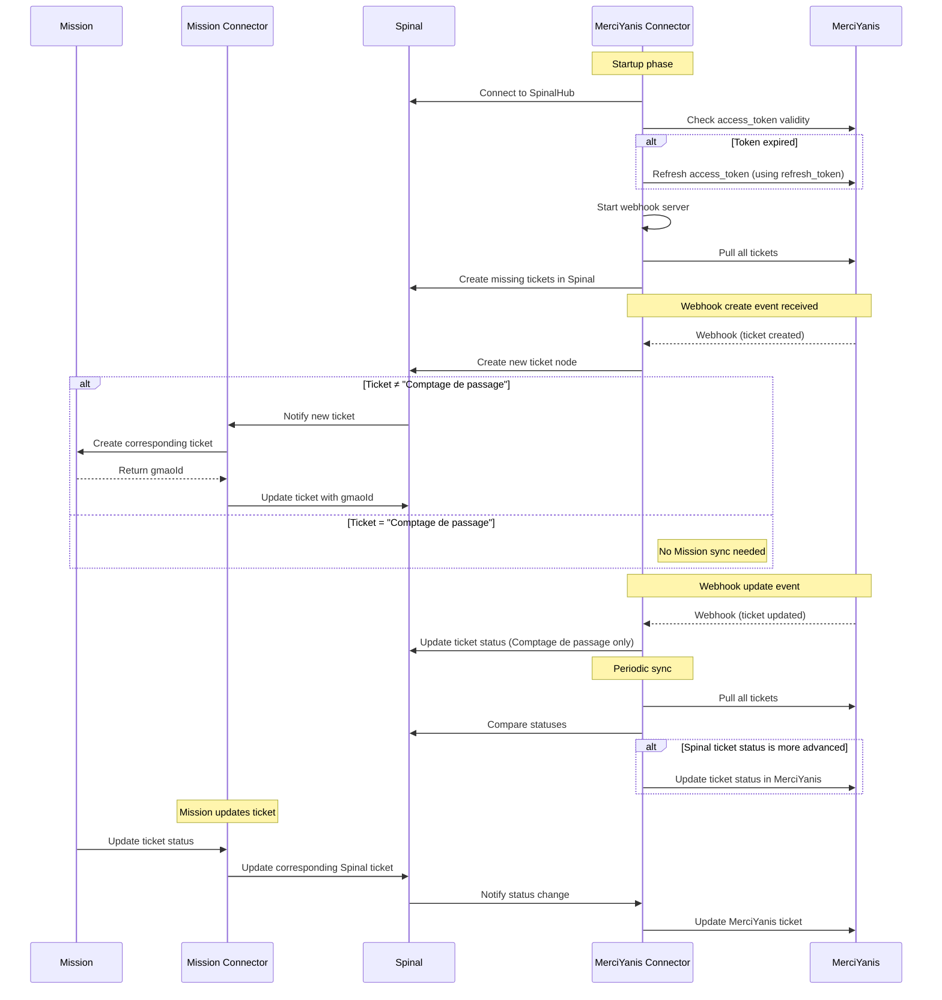

# spinal-organ-connector-merciyanis
Simple BOS-MERCIYANIS api connector to sync ticket events

https://merciyanis.notion.site/webhooks


https://merciyanis.notion.site/rest-api

## Getting Started

These instructions will guide you on how to install and make use of the spinal-organ-connector-merciyanis.

### Prerequisites

This module requires a `.env` file in the root directory with the following variables:

```bash
SPINAL_USER_ID=                             # The id of the user connecting to the spinalhub
SPINAL_PASSWORD=                            # The password of the user connecting to the spinalhub
SPINALHUB_IP=                               # The IP address of the spinalhub
SPINALHUB_PROTOCOL=                         # The protocol for connecting to the spinalhub (http or https)
SPINALHUB_PORT=                             # The port for connecting to the spinalhub
DIGITALTWIN_PATH=                           # The path of the digital twin in the spinalhub
SPINAL_ORGAN_NAME=                          # The name of the organ
SPINAL_CONFIG_PATH=                         # The path of the config file in the spinalhub exemple : /etc/Organs/{OrganName}
```


### Installation

Clone this repository in the directory of your choice. Navigate to the cloned directory and install the dependencies using the following command:
    
```bash
spinalcom-utils i
```

To build the module, run:

```bash
npm run build
```

### Usage

Start the module with:

```bash
npm run start
```

Or using [pm2](https://pm2.keymetrics.io/docs/usage/quick-start/)
```bash
pm2 start index.js --name organ-connector-merciyanis
```


### Sequence Diagram — Mission <-> Mission Connector <-> Spinal <-> MerciYanis Connector <-> MerciYanis




```